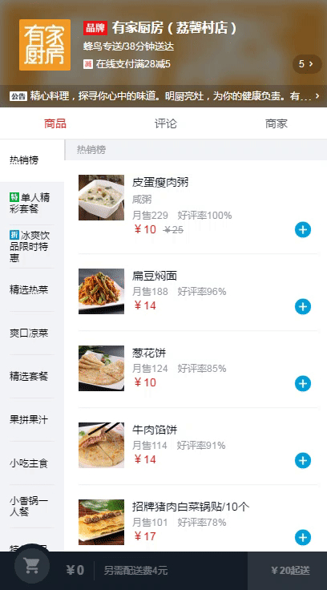
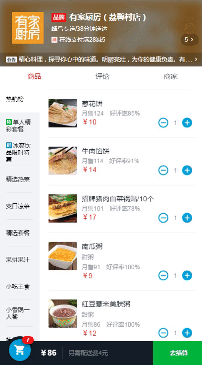
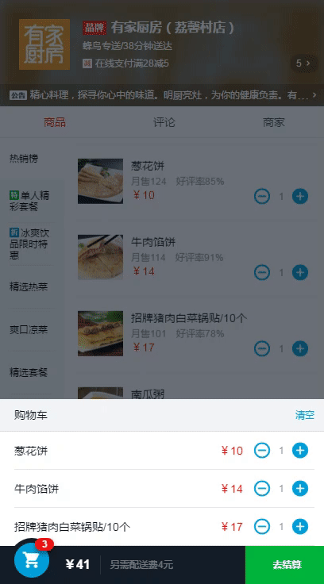

# takeaway

基于Vue.js 2.0开发的一个外卖 App

## Build Setup

``` bash
### install dependencies
npm install

### serve with hot reload at localhost:8080
npm run dev

### build for production with minification
npm run build

### build for production and view the bundle analyzer report
npm run build --report
```

## 功能

本外卖 App 目前开发的是一个外卖 APP 最核心的模块：商家模块，完整的实现了商品展示、把商品添加进购物车或者从购物车里移除、下单、对商品的评论展示、对商家的评论展示和商家详情展示等功能。

## demo

### 商品展示，展示商品分类和商品列表，两个列表是联动的。



### 商家信息


### 添加商品进购物车


### 购物车


### 在购物车里添加或移除商品



### 清空购物车



### 商品详情展示，展示商品的详情，并且可以选择想看的评论类型，比如查看全部的评论、只看点赞的评论、只看踩的评论或者只看有内容的评论。还可以在该页面进行添加商品进购物车或者从购物车移除该商品的操作。


### 商家评论展示，同样可以选择想看的评论类型，比如查看全部的评论、只看点赞的评论、只看踩的评论或者只看有内容的评论。


### 商家详情页，展示一些商家详细的信息，并且可以对商家进行收藏。


## 技术点

1. 使用 vue-resource 和后端进行交互，拿取数据。
2. 使用 vue-router 进行前端路由，实现 SPA。
3. 滚动效果使用 better-scroll，获得接近原生的滚动体验。 
4. 最大程度进行组件化，方便功能的复用，比如切换评论类型组件和星星评分组件。
5. html5 localstorage 用于根据商家 id 保存其收藏状态。
6. 图标字体的使用
7. 移动端 1px 边框
8. CSS sticky footer 布局
9. flex 弹性布局
10. webpack 模块打包
11. eslint 对 es6 进行代码风格检查